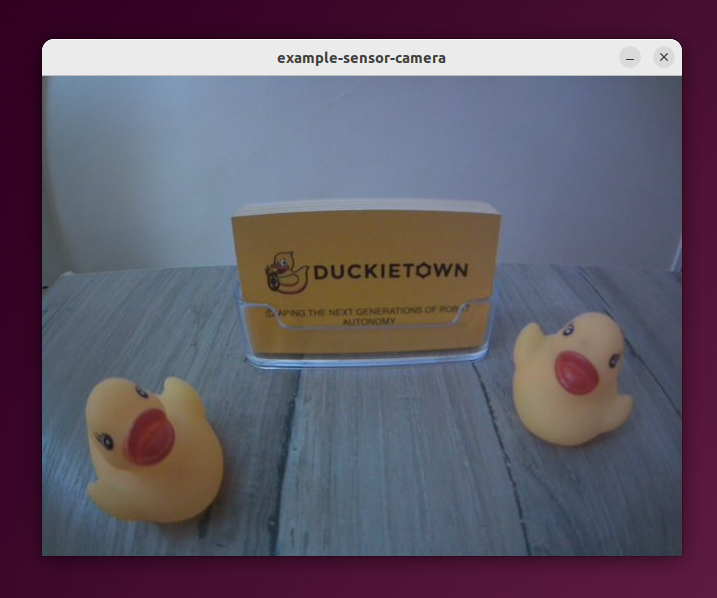

# Example: ROS - Sensor - Camera

This example shows how to subscribe to a continuous stream of camera frames via ROS.

## 1. Build

Build this project using the command,

```shell
dts devel build
```

## 2. Run

Run the project using the command,

```shell
dts devel run -X -R [ROBOT_NAME]
```

**NOTE:** Make sure to replace `[ROBOT_NAME]` with the name of the robot you are using in the commands above.

**NOTE:** The `-X` flag is used to give the project permissions to open a window to show the camera feed.


### Expected Result

You should see a window showing the live camera feed of the robot similar to the one below,

<p align="center">
  
</p>
