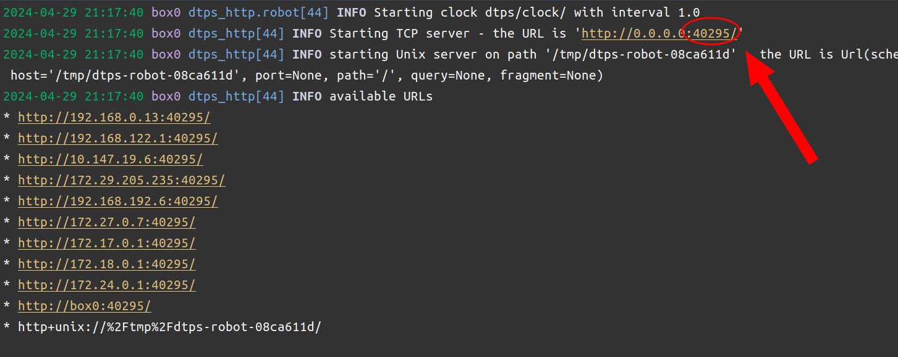

# Example: DTPS - Sensor - Time-of-Flight

This example shows how to measure the distance to the closest object using a robot's time-of-flight sensor in DTPS.

## 1. Build

Build this project using the command,

```shell
dts devel build
```

## 2. Run

Run the project using the command,

```shell
dts devel run -R [ROBOT_NAME]
```

**NOTE:** Make sure to replace `[ROBOT_NAME]` with the name of the robot you are using in the commands above.


### 2.1 Run against the Duckiematrix

If you want this example to connect to an instance of the Duckiematrix instead of a physical robot, find the
port number the instance of the Duckiematrix you are running is using as shown in the image below and then add
`-- -e PORT=<PORT_NUMBER>` to the `dts devel run` command above
(for example, in the example in the image below, we would add `-- -e PORT=40295`).

<p align="center" style="padding: 12px 40px 0 40px; border-left: 5px solid grey">
  
</p>


## 3. Expected Result

You should see a string being printed on the console showing the live reading (distance) from the time-of-flight sensor.
